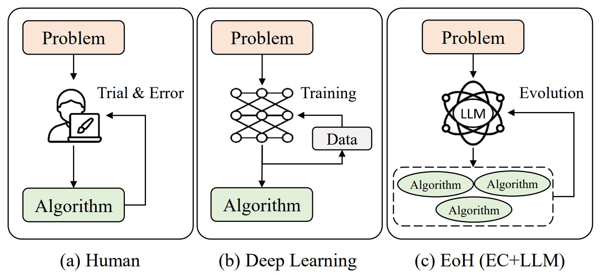
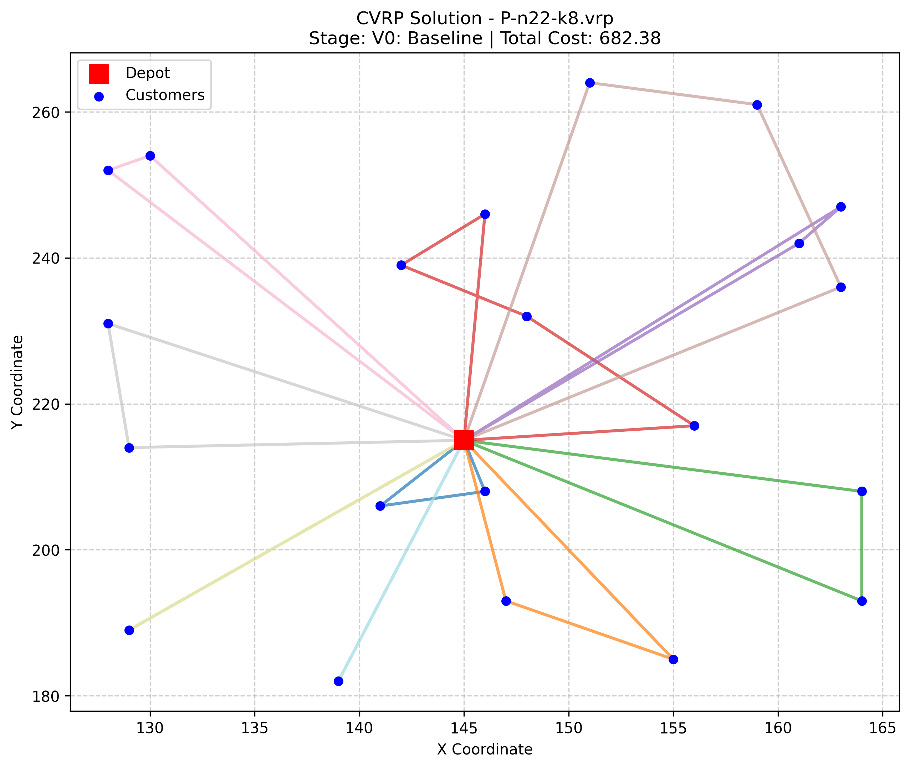
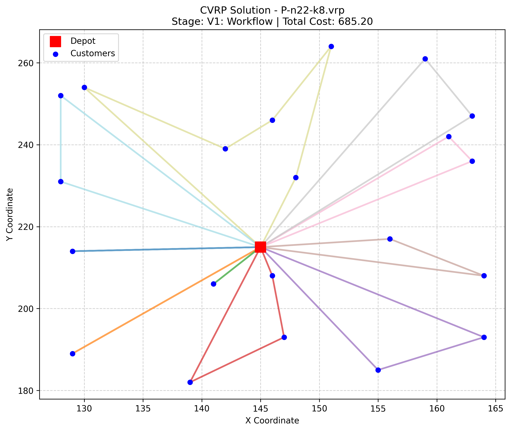
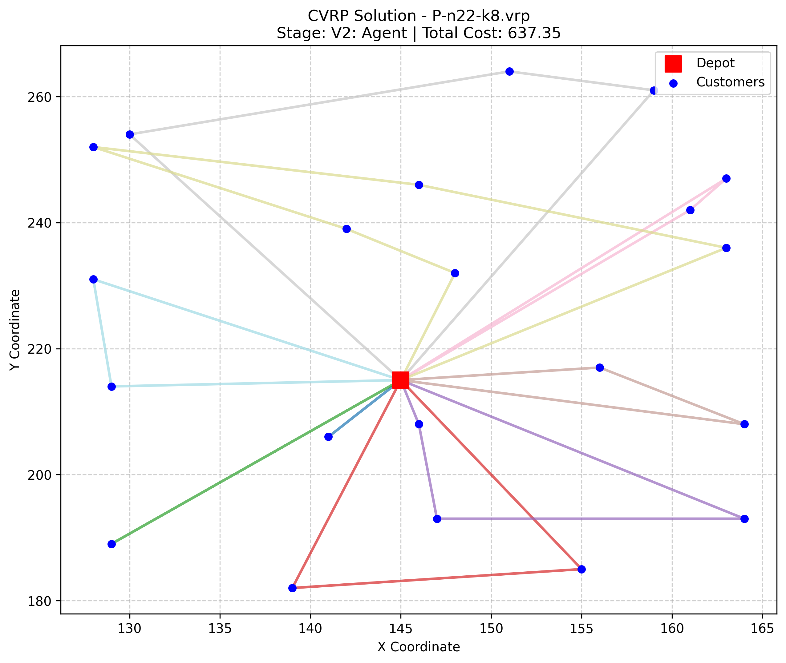
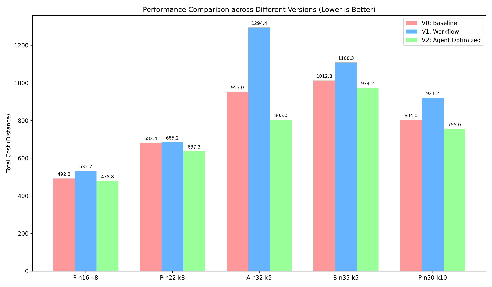
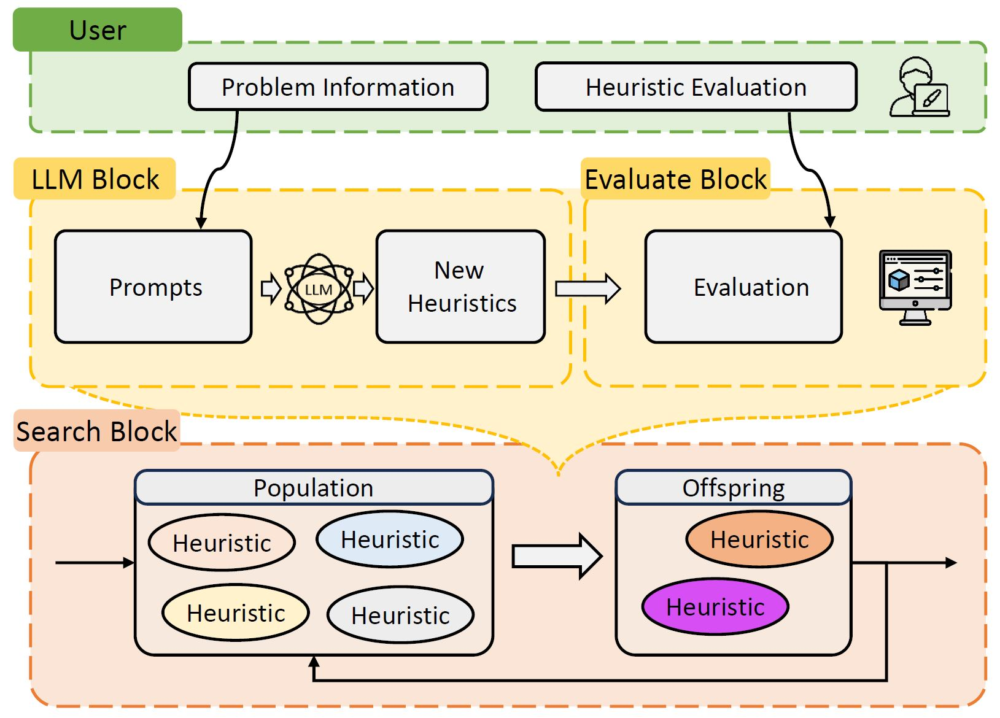
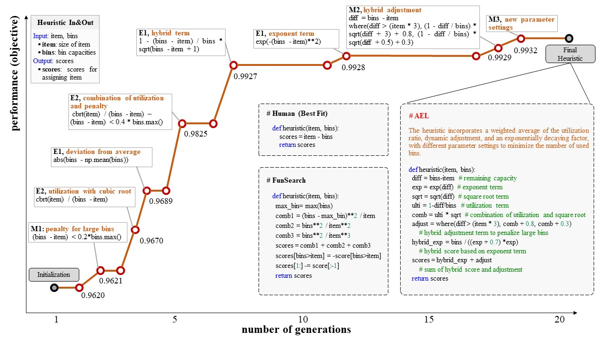

<div align=center>
<h1 align="center">
EoH: Evolution of Heuristics 
</h1>
<h5 align="center">
进化计算+大模型 自动算法设计平台
</h5>

 [English Version 英文版本](./README.md)

[![Github][Github-image]][Github-url]
[![License][License-image]][License-url]
[![Releases][Releases-image]][Releases-url]
[![Wiki][Wiki-image]][Wiki-url]


[Github-image]: https://img.shields.io/badge/github-12100E.svg?style=flat-square
[License-image]: https://img.shields.io/badge/License-MIT-orange?style=flat-square
[Releases-image]: https://img.shields.io/badge/Release-Version_1.0-blue?style=flat-square
[Installation-image]: https://img.shields.io/badge/Web_Demo-Version_1.0-blue?style=flat-square
[Wiki-image]: https://img.shields.io/badge/Docs-参考文档-black?style=flat-square


[Github-url]: https://github.com/FeiLiu36/EOH
[License-url]: https://github.com/FeiLiu36/EOH/blob/main/LICENSE
[Releases-url]: https://github.com/FeiLiu36/EOH/releases
[Wiki-url]: https://github.com/FeiLiu36/EOH/tree/main/docs


</div>
<br>


**演变计算** + **大型语言模型**的平台，用于自动算法设计。



---
##  新闻  🔥 

+ 2024.5.5 [L-AutoDA: Leveraging Large Language Models for Automated Decision-based Adversarial Attacks](https://arxiv.org/abs/2401.15335) 已被 **GECCO 2024** 录用了! 🎉
+ 2024.5.2 [EoH (Evolution of Heuristics: Towards Efficient Automatic Algorithm Design using Large Language Model)](https://arxiv.org/abs/2401.02051) 已被 **ICML 2024** 录用了！🎉

---

## 🖼️ 版本演进效果演示 (Version Evolution)

| V0: 基础演化 (Baseline) | V1: 自动化流水线 (Workflow) | V2: ReAct 智能体 (Agent) |
| :---: | :---: | :---: |
|  |  |  |
| *基础贪心策略 (Nearest Neighbor)* | *全局启发式搜索 (Sweep)* | *智能体自主优化 (Farthest Insertion + Local Search)* |

### 📈 性能量化对比 (Performance Benchmark)

下图展示了三个版本在不同 CVRP 实例上的总路径成本对比（数值越低代表性能越好）：



---

## 简介


启发式算法在解决复杂的搜索和优化问题时是不可或缺的。然而，手动启发式设计是繁琐的，需要大量的人类直觉和经验。

EOH引入了一种新的范式，利用大型语言模型（LLMs）和演变计算（EC）之间的协同作用进行自动启发式设计（AHD）。思维和代码在演变框架内的共同演化为卓越的AHD性能，同时降低了计算成本。



EOH在分钟/小时内设计出了非常有竞争力的算法/启发式方法。例如，在在线装箱问题上，EoH自动设计出新的最优启发式算法，优于人工设计算法和同期谷歌工作FunSearch。

下图显示了在在线装箱问题上EOH的演变。我们概述了在演变过程中对最佳结果有所贡献的关键**思想**和相应的**代码**。此外，我们标记了导致改进的提示策略。最后，我们展示了最终种群中的最优启发式方法，并将其与人类设计的启发式方法和来自FunSearch的启发式方法进行了比较。




如果您发现EoH对您的研究或应用项目有所帮助：

```bibtex
@inproceedings{fei2024eoh,
    title={Evolution of Heuristics: Towards Efficient Automatic Algorithm Design Using Large Language Model},
    author={Fei Liu, Xialiang Tong, Mingxuan Yuan, Xi Lin, Fu Luo, Zhenkun Wang, Zhichao Lu, Qingfu Zhang},
    booktitle={International Conference on Machine Learning (ICML)},
    year={2024},
    url={https://arxiv.org/abs/2401.02051}
}
```

如果您对LLM4Opt或EoH感兴趣，您可以：

+ 通过电子邮件fliu36-c@my.cityu.edu.hk与我们联系。
+ 欢迎访问[大模型与优化参考文献和研究论文收藏](https://github.com/FeiLiu36/LLM4Opt)
+ 加入我们的讨论组（即将推出）

如果您在使用代码时遇到任何困难，请通过上述方式与我们联系或提交[问题]。

## 系统要求
+ python >= 3.10
+ numba
+ numpy
+ joblib

## EoH示例用法
第1步：安装EoH
我们建议在具有python>=3.10的[conda](https://conda.io/projects/conda/en/latest/index.html)环境中安装和运行EoH

```bash
cd eoh

pip install .
```
 
第2步：尝试示例：
**在开始前设置您的端点和密钥以远程LLM或在启动之前设置您的本地LLM！**

**例如： 把 llm_api_endpoint 设置为 "api.deepseek.com", 把 llm_api_key 设置为 "your key",把 llm_model 设置为 "deepseek-chat".**
```python
from eoh import eoh
from eoh.utils.getParas import Paras

# Parameter initilization #
paras = Paras() 

# Set parameters #
paras.set_paras(method = "eoh",    # ['ael','eoh']
                problem = "bp_online", #['tsp_construct','bp_online']
                llm_api_endpoint = "xxx", # set your LLM endpoint
                llm_api_key = "xxx",   # set your LLM key
                llm_model = "gpt-3.5-turbo-1106",
                ec_pop_size = 5, # number of samples in each population
                ec_n_pop = 5,  # number of populations
                exp_n_proc = 4,  # multi-core parallel
                exp_debug_mode = False)

# initilization
evolution = eoh.EVOL(paras)

# run 
evolution.run()
```

 
###### 示例1：旅行商问题的构造算法
```bash
cd examples/tsp_construct

python runEoH.py
```

 
###### 示例2：在线装箱问题
（在您的个人计算机上在30分钟内生成新的最佳启发式方法并击败Funsearch！ i7-10700 2.9Ghz, 32GB）

```bash
cd examples/bp_online

python runEoH.py
```
 
###### 示例3：使用EoH解决您的本地问题
```bash
cd examples/local_problem

python runEoH.py
```
 
### 使用EoH平台的更多示例（代码和论文）
#### 组合优化
+ 在线装箱问题 (BP)，贪婪启发式方法，代码, [论文]
+ 旅行商问题 (TSP)，构造启发式方法，代码, [论文]
+ 旅行商问题 (TSP)，引导式局部搜索，[代码], [论文]
+ 流水车间调度问题（FSSP），引导式局部搜索，[代码], [论文]
#### 机器学习
+ 图像攻击，[代码], [论文](https://arxiv.org/abs/2401.15335)
#### 贝叶斯优化
+ 获取函数自动设计，[论文](https://arxiv.org/abs/2404.16906)
#### 数学
+ 可接受集合
#### 物理学
+ 计算流体动力学

## 在您的应用程序中使用EoH
提供了这里的逐步指南（即将推出）

## 大模型设置
1) 远程LLM + API（例如， GPT3.5, Deepseek, Gemini Pro) （推荐！）：
+ OpenAI API。
+ [Deepseek API](https://platform.deepseek.com/)
+ 其他API：
  + https://yukonnet.site/ (Llama, Llamacode, Gemini Pro, 等)
  + https://github.com/chatanywhere/GPT_API_free
  + https://www.api2d.com/
2) 本地LLM部署 + API（例如，Llamacode，instruct Llama，gemma，deepseek等）：
+ 第1步：下载Huggingface模型，例如，下载gemma-2b-it（git clone https://huggingface.co/google/gemma-2b-it）
+ 第2步： + cd llm_server + python gemma_instruct_server.py
+ 第3步：将运行服务器生成的url复制到request.py（例如，将url='http://127.0.0.1:11012/completions'设置为测试您的服务器部署)。
+ 第4步：将运行服务器生成的url复制到您的示例中的runAEL.py中（例如，将url='http://127.0.0.1:11012/completions'设置该项）。
+ 第5步：Python runAEL.py
3) 自己的实现：
+ 如果您想使用其他LLM或自己的GPT API或本地LLMs，请在ael/llm中添加您的接口

## 关于LLM4Opt的相关工作
欢迎访问[大模型与优化参考文献和研究论文收藏](https://github.com/FeiLiu36/LLM4Opt)

## 贡献者
 [Rui Zhang](https://github.com/RayZhhh) 
 [Zhiyuan Yang](https://github.com/yzy1996) 
 [Ping Guo](https://github.com/pgg3)  
 [Shunyu Yao](https://github.com/ShunyuYao6)


